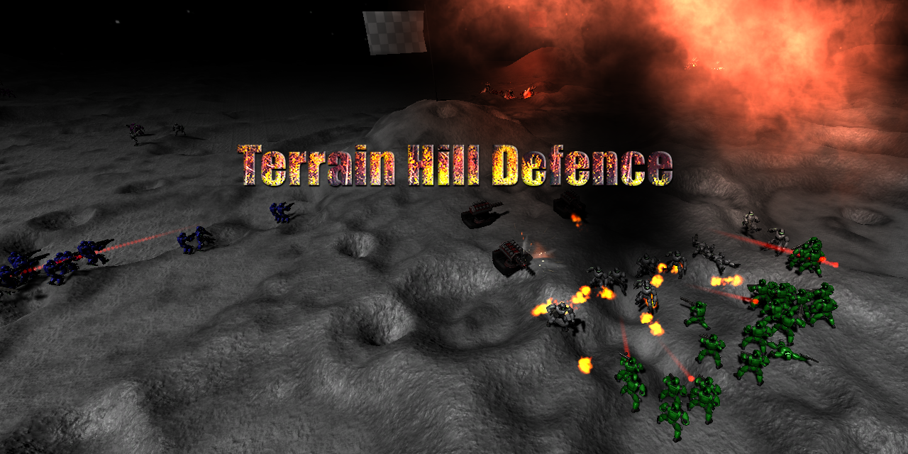

# Hill Defence

This game is a tower defence game. The player controls a tower which is placed on a terrain. The tower can shoot at enemies and deal damage to them.

## Requirements

Unity 2021.2.5f1

## Controls

- WASD : basic movement
- SHIFT : Makes camera accelerate
- Mouse : Mouse look
- Scroll wheel : Height over terrain
- mouse click right: set lock/unlock movement 
- mouse click left: Show the tower to place it on the terrain (The tower is painted in the color of the team of the nearest tower, if it is far from the tower it will be painted black and cannot be instantiated.)
- mouse double click left: Placing the tower on the terrain.
- M : Show/hide minimap.
  
## Implemented

* Team flags are randomly generated on the ground, through an algorithm, at a minimum distance from each other.

* The colours of each team are generated through an array of colours. This is applied to the flag and the soldiers.

* The nearest flag is set as the enemy of each team.

* Soldiers are generated around the flag, taking into account that there is a minimum distance between them.

* The soldiers aim to destroy the enemy flag, but if they encounter enemies in their attack range, they will try to destroy them.

* Soldiers and flags have a number of hits to be destroyed.

* Place turrets to defend a flag.

* Improve the soldiers AI, take into account the soldiers of other teams.

* add minimap on keypress M
  
* Improve the initial and find enemy performance 

## TO DO

* Improve the movement of soldiers to avoid colliding with turrets.

* Improve the soldiers AI, who are under attack, as well as defend the flag when it is under attack.

* Show the percentage of available health for each soldier.

* Create a UI with information about the game and the winner.

## Code description

- SceneConfig: static class with general game parameters.

- FlyCamera controller for the game camera and interactivity.

- HillDefenceCreator: Main class in charge of generating flags and soldiers.

- TeamSoldier Each soldier has this class which is in charge of searching for enemies, firing and damage assessment.

- TargetTerrain: Generate the hills that cover the target of the flag. It receives collisions from soldiers' shots and modifies the terrain and generates explosions.

- MapController: Paint minimap and the player camera position.

- AiController: FindEnemy logic.

## Change log

* 2021-10-12 Fix towers shoot and change enemy when attack npc
* 2021-10-07 Simplify destruction terrain, fix tower shoot
* 2021-09-19 Separte to MapController from AIController
* 2021-09-11 fix tower instanciate and find enemy
* 2021-09-11 fix tower instanciate and find enemy
* 2021-09-10 improve and fix AI npc enemies
* 2021-08-15 add player position on minimap
* 2021-08-13 add minimap
* 2021-08-08 Improve the soldiers AI, take into account the soldiers of other teams.
* 2021-08-07 Creater towers defence near the flag base with mouse double click
* 2021-08-05 ramdomize the soldiers list
* 2021-08-04 show win
* 2021-08-04 destroy flag hill
* 2021-08-04 When a base is eliminated the team must go for the next one.
* 2021-08-04 Ajust soldiers find enemy and shoot
* 2021-08-04 change logic find enemy
* 2021-08-03 detroy flags
* 2021-08-03 simplify findenemy
* 2021-08-03 add enemy logic
* 2021-08-03 test shoot
* 2021-08-03 Enemies move and find targets
* 2021-08-02 asign team to soldier
* 2021-08-01 add teams class
* 2021-08-01 spawn enemies per team
* 2021-08-01 add teams class
* 2021-08-01 add teams class
* 2021-08-01 add teams flag colors
* 2021-08-01 spawn hills in minimal distance between
